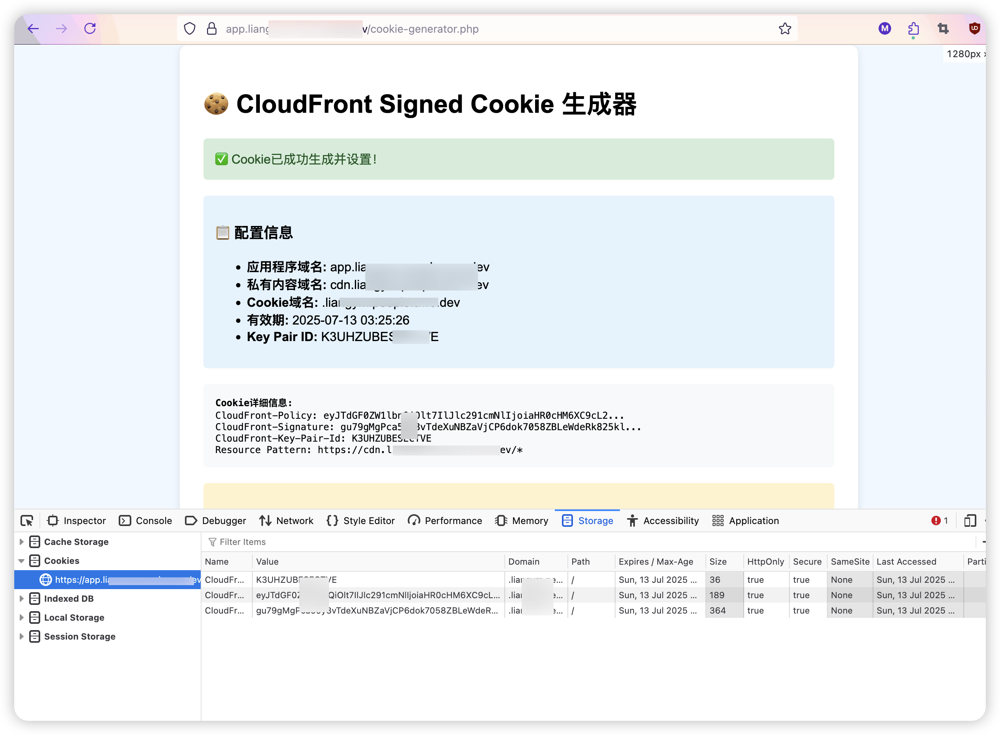
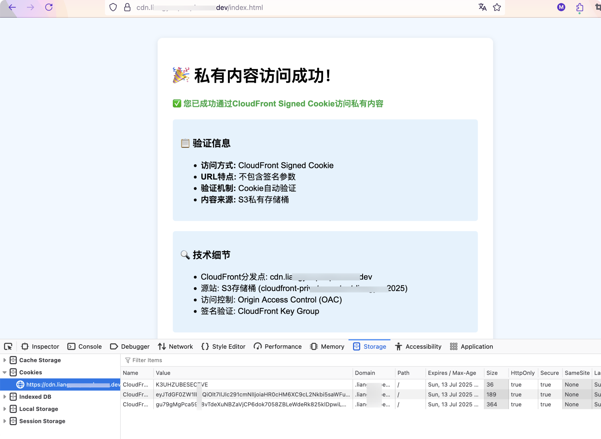
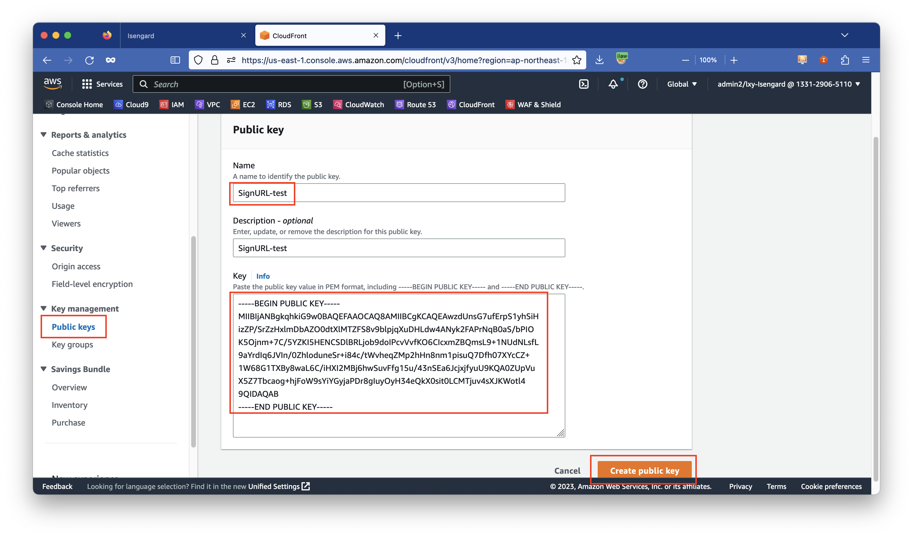
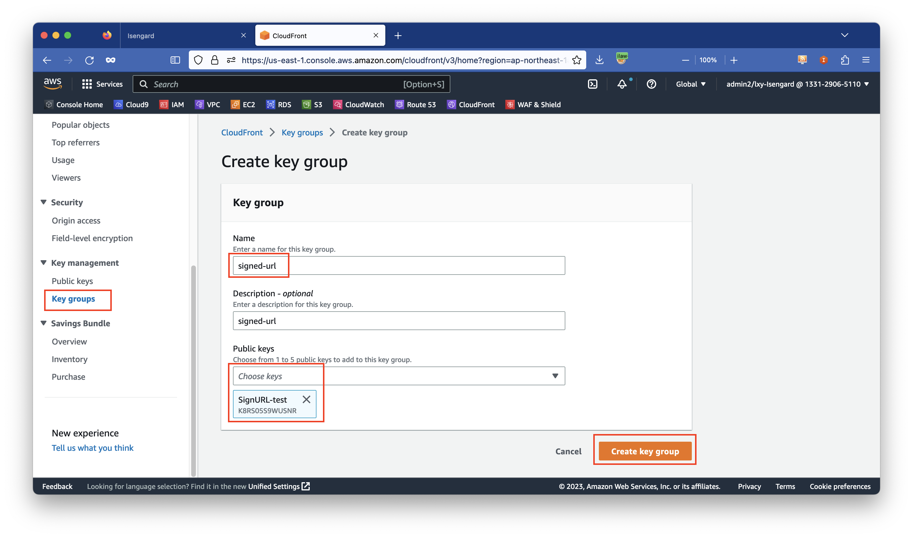
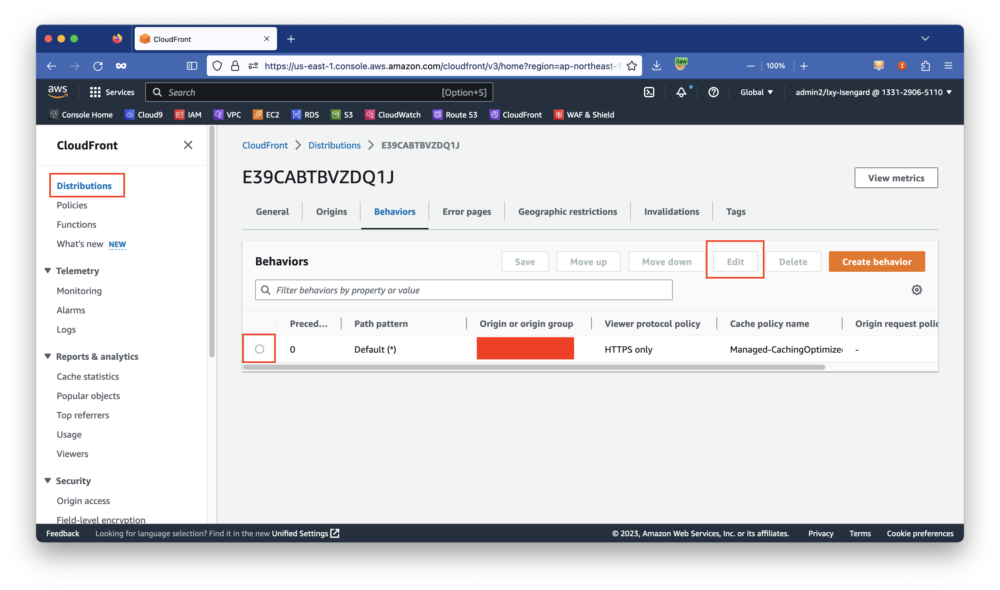
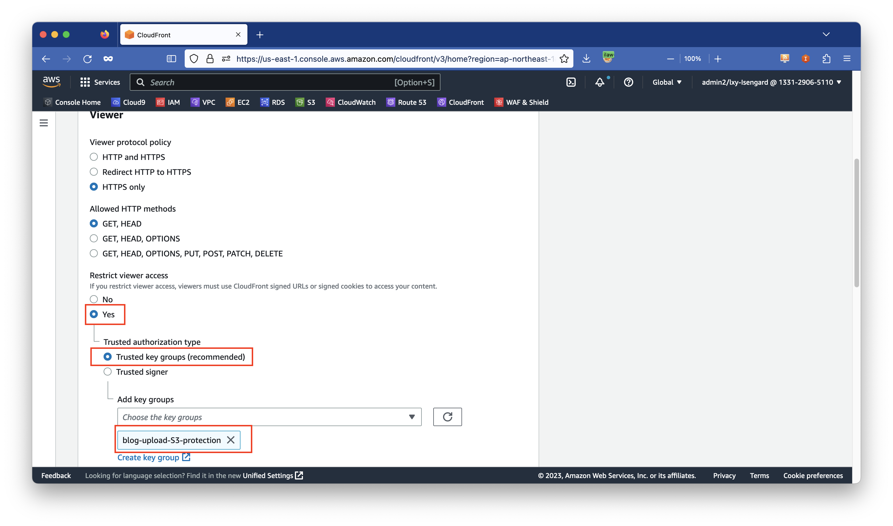
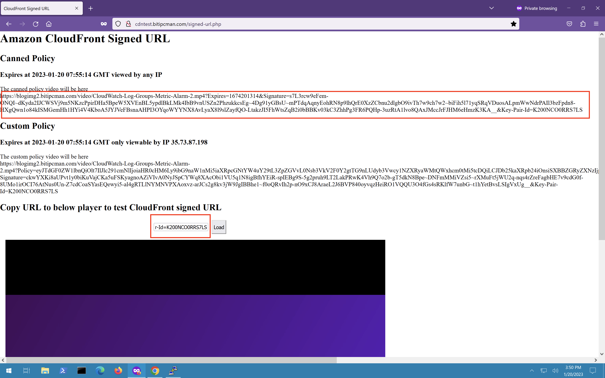
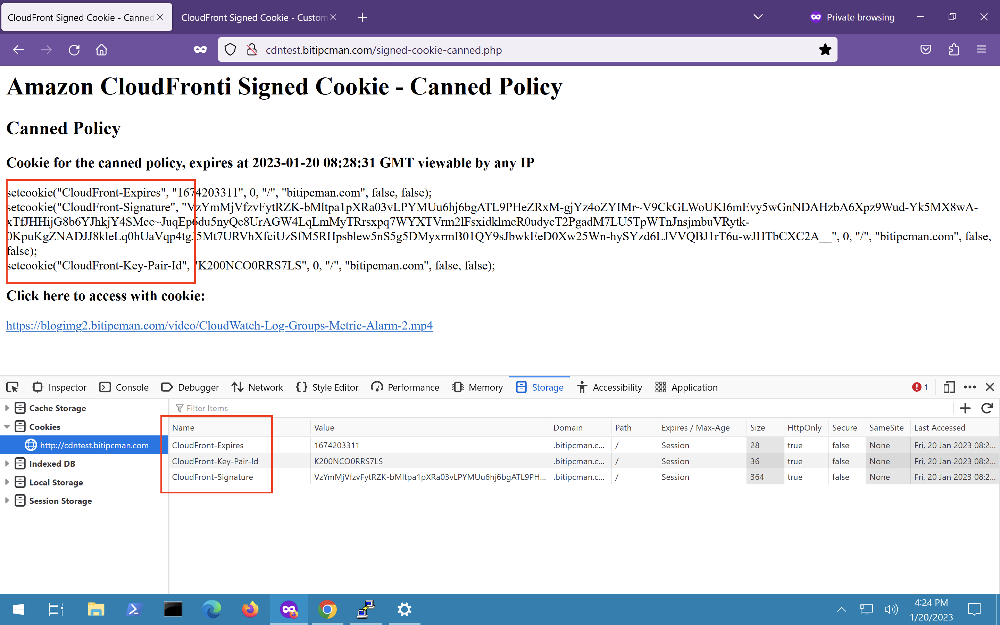
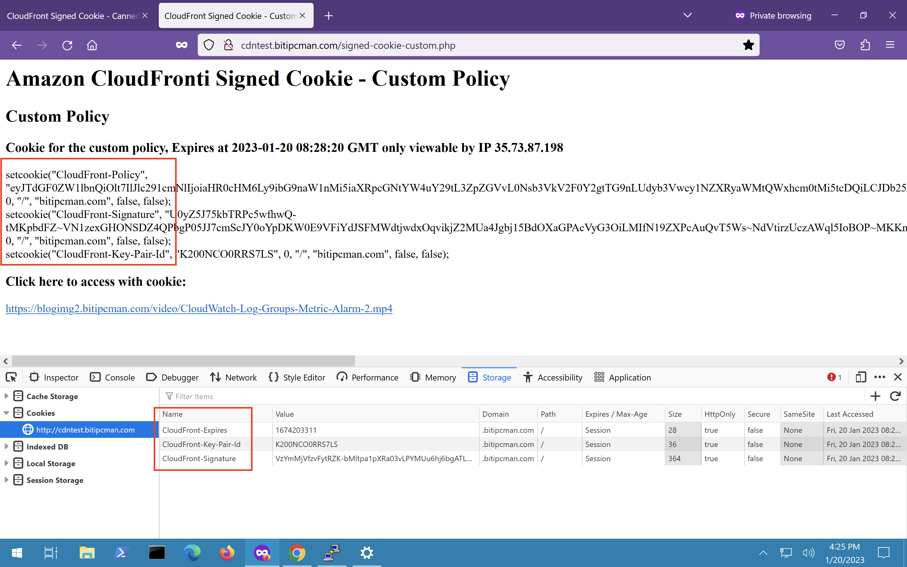

# 提供DEMO实测 - CloudFront 签名上手：使用 CloudFront 做 S3 存储桶的私有内容分发


## 第一章节：补充DEMO实测与部署 CloudFront双分发点 - Signed Cookie解决方案


我已经成功完成了CloudFront双分发点的部署和测试，并修复了所有遇到的错误。以下是完整的总结：

## 📋 项目概述

本项目实现了CloudFront Signed Cookie的标准使用场景，包含两个CloudFront分发点：

- **应用程序分发点**: 不开启签名，用于生成Cookie
- **私有内容分发点**: 开启签名，通过Cookie验证访问权限

## 🏗️ 架构说明

```
用户浏览器
    ↓
app.domain.com (应用程序分发点)
    ↓ 生成Cookie
用户浏览器 (携带Cookie)
    ↓
cdn.domain.com (私有内容分发点)
    ↓ 验证Cookie
私有内容 (S3)
```

### 关键特性

- ✅ URL中不包含签名参数

- ✅ 跨子域名Cookie共享

- ✅ 自动身份验证

- ✅ 标准使用流程


## 📁 演示效果





## 📁 项目结构

```
cloudfront-dual-distribution/
├── README.md                    # 项目说明文档
├── QUICK_START.md              # 快速开始指南
├── configs/                    # 配置文件
│   ├── config-r53-dual-distribution.php
│   ├── cloudfront-app-r53-distribution.json
│   ├── cloudfront-cdn-r53-distribution.json
│   ├── route53-dns-records.json
│   └── s3-bucket-policy.json
├── templates/                  # 应用程序模板
│   ├── app-r53-main.php       # 主应用程序页面
│   ├── cookie-generator.php   # Cookie生成器
│   ├── cookie-test.php        # Cookie测试页面
│   └── simple-test.php        # 简单测试页面
├── scripts/                   # 部署脚本
│   ├── deploy-dual-distribution.sh
│   └── verify-deployment.sh
├── tests/                     # 测试文件
│   ├── test-private-content.html
│   └── test-private-document.txt
├── keys/                      # 密钥文件
│   ├── private.pem
│   └── cloudfront-test-key.pem
└── docs/                      # 文档
    ├── CloudFront-SignedURL-Cookie-部署指南.md
    ├── CloudFront双分发点部署指南-R53.md
    ├── final-test-report.md
    ├── DEPLOYMENT_SUCCESS.md
    └── deployment-summary.txt
```

## 🚀 快速开始

### 前置条件

1. AWS CLI已配置
2. 拥有Route 53 Hosted Zone
3. 有效的SSL证书 (ACM)
4. CloudFront Key Pair和私钥文件

### 一键部署

```bash
# 1. 克隆或下载项目文件
# 2. 修改配置文件中的域名和资源信息
# 3. 执行部署脚本
./scripts/deploy-dual-distribution.sh
```

### 验证部署

```bash
# 验证部署状态
./scripts/verify-deployment.sh
```

## ⚙️ 配置说明

### 主要配置文件

1. **configs/config-r53-dual-distribution.php**
   - PHP应用程序配置
   - 域名设置
   - Cookie配置

2. **configs/cloudfront-app-r53-distribution.json**
   - 应用程序分发点配置
   - 不开启签名验证

3. **configs/cloudfront-cdn-r53-distribution.json**
   - 私有内容分发点配置
   - 开启签名验证

### 需要修改的配置项

```php
// configs/config-r53-dual-distribution.php
$main_domain = 'your-domain.com';           // 修改为你的域名
$key_pair_id = 'YOUR_KEY_PAIR_ID';          // 修改为你的Key Pair ID
```

```json
// configs/cloudfront-*-distribution.json
"DomainName": "your-elb-domain.com",        // 修改为你的ELB域名
"Items": ["app.your-domain.com"]            // 修改为你的域名
```

## 🧪 测试流程

### 1. 基础功能测试

```bash
# 测试应用程序分发点
curl https://app.your-domain.com/cookie-generator.php

# 测试私有内容分发点 (应该返回MissingKey错误)
curl https://cdn.your-domain.com/index.html
```

### 2. 端到端测试

```bash
# 生成Cookie并测试私有内容访问
curl -c cookies.txt https://app.your-domain.com/cookie-generator.php
curl -b cookies.txt https://cdn.your-domain.com/index.html
```

## 📖 详细文档

- [部署指南](docs/CloudFront双分发点部署指南-R53.md)
- [测试报告](docs/final-test-report.md)
- [成功案例](docs/DEPLOYMENT_SUCCESS.md)


## 第二章节、理论依据 - 博客原文

https://aws.amazon.com/cn/blogs/china/cloudfront-signature-with-signed-url-and-cookie-for-private-content-delivery/ 

### 1、传统企业与内容分发

以往，私有内容分发一直是数字原生的互联网行业的技术需求，广泛用于经过会员体系验证的版权内容分发，包括但不限于视频播放、音频播放、游戏下载、软件分发等。

如今，随着传统企业的数字化转型越来越普遍，大量企业内部应用技术栈全面互联网化，许多企业的应用系统已经突破了传统的 VPN 内网概念，转而在互联网上运行。企业日常运营产生各种流程文档、数据文件、日志等需要被分发给员工和第三方合作伙伴。这种场景下如何能有保护地企业私有内容的安全分发，就称为了企业数字化转型的安全关键。

### 2、使用 CloudFront 签名的场景

大部分企业配置 CloudFront 时候是按照公开访问来分发的，场景相对较广，通常分发对象是网页和 APP 中嵌入的图片、视频、CSS、JS 代码。这些资源可以通过 URL 地址在互联网上被公开地、匿名地访问。

而私有内容的场景一般指经过用户授权才可以访问的，例如互联网领域的购买电子书、订阅的软件更新、会员视频观看等场景。对应传统企业数字化转型的落地的应用，通常指企业内部运营文档、报告、扫描件影印件、数据文件、配置文件、日志等文件。

私有内容分发的安全需求是抵御未经授权的访问、盗链和 DDOS 攻击。如果恶意的访问者将私有内容的访问链接分发到别的平台上，首先会造成企业运营隐私的泄密，同时对整个软件平台带来额外流量负载，可能使系统无法正常响应业务。同时，盗链等非授权访问导致网络流量的上涨，由此导致云使用成本飙升。

因此，使用包括 CloudFront 签名为主的技术手段对要分发的内容进行防护是十分必要的。当启用 CloudFront 签名功能后，现有整个发布点的所有请求都只接受签名验证成功的访问，不接受匿名访问。由此，大大提升了分发内容的私密性和安全性。

### 3、在 S3 签名和 CloudFront 签名之间选择

亚马逊云科技的存储服务 S3 作为数据湖的核心，能满足多种功能类型的图片、图像、视频、文档、日志的存储、分析、检索等功能。在 S3 上，也提供了被称为 Pre-Sign URL 的签名功能，用于向用户提供需要授权场景下的访问。那么如何在 S3 Pre-Sign URL 和 CloudFront 签名之间做出选择呢？

二者具体对比如下：

 

|      | **S3 Pre-Sign URL**                                          | **CloudFront** **签名**                                      |
| ---- | ------------------------------------------------------------ | ------------------------------------------------------------ |
| 证书 | S3 服务生成证书，用户调用 S3 接口生成签名 URL                | 用户自行生成证书，应用层计算获得签名，然后在云端校对         |
| 源站 | S3 对外提供服务要求文件必须在 S3 上                          | 而 CloudFront 签名机制允许被分发的原始文件在 ELB、S3、EC2 或者其他外部源等多种功能位置 |
| 保护 | S3 Pre-sign URL 可以保护单个文件，但会暴露存储桶的名称、路径等信息，可能会继续引发穷举遍历等攻击 | CloudFront 可实现整个发布点的强制签名检查，不怕扫描和遍历    |
| 行为 | S3 仅支持 Pre-signed URL，因此应用系统内已经存在的 S3 文件访问路径都需要变更，末尾需要加上一串 token，这对已经设计好的应用可能存在影响 | CloudFront 的 Signed-URL 签名方式也需要在末尾加上 token；使用 Signed Cookie 签名则不改动 URL |
| 加速 | S3 是单个 region 的服务，如果访问者位于全球各地，还需要开启 S3 Transfer Acceleration ，而 S3 传输加速由会产生在普通 S3 DTO 之外的额外加速流量费，成本相对较高 | CloudFront 加速点，覆盖好，此外本身 CloudFront 带有缓存能力，对源站无压力，适合大量分发；流量费成本很低 |
| 授权 | S3 只能限制文件过期时间，不支持设置授权开始的起始时间；此外 S3 签名不支持针对访问者 IP 的详细控制，只能在全桶级别限制访问 IP，局限较大 | CloudFront 签名可以限制文件起始时间、结束时间、IP 地址等，此外还可结合 Route53 和 CloudFront 的地理位置功能做多种策略 |
| 安全 | S3 对外直接提供访问不支持 AWS WAF 服务集成，无法设置针对文件扩展名的规则，无法检查各种 HTTP 头，安全特性较差 | CloudFront 支持 WAF 集成，可实现多种策略防护。对于 WAF 不能直接满足的安全检查和校验，还可以使用 CloudFront Function 或 Lambda@Edge 等边缘计算实现 |

通过以上对比可以看出，当要分发的源文件在 S3 上的时候，使用 CloudFront 的签名功能替代 S3 签名是更好的选择。

### 4、CloudFront 后端的 S3 源站保护

CloudFront 服务去访问内容所在的源站的过程被称为回源。在 CloudFront 分发私有内容的场景中，被分发的文件所在的源站也需要进行保护。当 CloudFront 回源时候，S3 存储桶本身不需要被设置为公开访问。S3 存储桶可以继续保持 Private 私有状态，然后 CloudFront 服务可以使用特别的身份认证机制访问私有的 S3 存储桶。

CloudFront 对 S3 源站保护功能之前采用源访问身份 Origin Access Identity（简称OAI）机制。由于 OAI 在访问策略授权时候是采用的统一的 OAI 身份，但是不能具体区分到单一发布点，因此在同一个存储桶同时配置 2 个 CloudFront 发布点时候（其中一个开启签名、另一个不开启），此时会存在权限管理无法细分的情况。由此，2022 年起被新的源访问控制功能 Origin Access Control (OAC)所取代。

一个典型的 OAC 需要在 S3 存储桶策略界面上配置如下策略：

```powershell
{
    "Version": "2012-10-17",
    "Statement": {
        "Sid": "AllowCloudFrontServicePrincipalReadOnly",
        "Effect": "Allow",
        "Principal": {
            "Service": "cloudfront.amazonaws.com"
        },
        "Action": "s3:GetObject",
        "Resource": "arn:aws:s3:::DOC-EXAMPLE-BUCKET/*",
        "Condition": {
            "StringEquals": {
                "AWS:SourceArn": "arn:aws:cloudfront::111122223333:distribution/EDFDVBD6EXAMPLE"
            }
        }
    }
}
```

由此即可将 S3 存储桶设置为仅接受 CloudFront 特定发布点的回源访问。

## CloudFront 签名的使用方式

### 1、在 Signed URL 或者 Signed Cookie 中直接做选择

CloudFront 签名使用的算法是 RSA-SHA1，目前 CloudFront 不支持其它算法。在签名完成后，客户端与 CloudFront 进行认证有两种身份认证方式，分别是 Signed-URL 和 Signed Cookie。

当使用 Signed-URL 时候，一个访问请求格式类似如下（客户端无需支持Cookie）：

```powershell
https://xxx.xxx.com/video/xxx.mp4?Expires=1672844363&Signature=n~hndmvrcnJRrF6s-WDQGdiWMx9BrLxNi-i6w67u8MUxuUX4uITa6x-J-1IHcVvajWIIOyezlsVBLD5gNwedgx10lq~YuiEW1mRCh~9RX-HwbH~TuHULhF1UIFMwm61scmhN90KSIKN87TPDsf5NO~vZ7AaM4D~9Dbua4qmwC6QMafLf~SFCHkdNkyFSJMHKWzCOrB8mP4Dw9Fp55uQxiOQ3NU9JMhOMEum4WVsJuO4tPcND3hvAtE92h6DsnbP~TRmS25Q8bwWWSWnlTLqxbbfDAp28c-upJYoRqzvymEEfkNGLoIUWLDkrs~Us5O2GitlhXlHmMzayE9eEq9zUEA__&Key-Pair-Id=K8RS05S9WUSNR
```

当使用 Signed Cookie 的时候，一个访问请求公司类似如下（要求客户端必须支持 Cookie）：

```powershell
https://xxx.xxx.com/video/xxx.mp4
```

同时 Cookie 信息如下：

```powershell
Set-Cookie: 
CloudFront-Expires=date and time in Unix time format (in seconds) and Coordinated Universal Time (UTC); 
Domain=optional domain name; 
Path=/optional directory path; 
Secure; 
HttpOnly

Set-Cookie: 
CloudFront-Signature=hashed and signed version of the policy statement; 
Domain=optional domain name; 
Path=/optional directory path; 
Secure; 
HttpOnly

Set-Cookie: 
CloudFront-Key-Pair-Id=public key ID for the CloudFront public key whose corresponding private key you're using to generate the signature; 
Domain=optional domain name; 
Path=/optional directory path; 
Secure; 
HttpOnly
```

两个方式主要在于客户端访问 CloudFront 服务时候的认证方式不同。生成二者签名的是同一个算法，因此在开发过程中，可一次签名生成 Token 等信息，对于不同文件类型按需使用。签名请求可使用多种常见语言包括 Java、Python、PHP 等生成签名。由此可以看到，如果不希望请求的文件名带上签名的 token，只是希望保留原始文件名，那么可选择用 Signed Cookie 方式。如果不介意请求 URL 的长度，或者是访问 CloudFront 的客户端不支持 Cookie，那么使用 Signed-URL 更简单。

需要注意的是，如果同时使用两种方式，在请求的 URL 上带有签名字符串，又设置了对应的 Cookie，此时只有 URL 地址生效，Cookie 无效。这个结论出处来自本文末尾的参考文档。

### 2、在 Canned Policy 或者 Custom Policy 两类策略中做出选择

CloudFront 签名对私有文件的授权有两种策略，一种是 Canned Policy，也被称为标准策略；另一种是 Custom Policy 自定义策略。

二者的区别是：

| **对比**                        | **Canned Policy**                            | **Custom Policy**                                          |
| ------------------------------- | -------------------------------------------- | ---------------------------------------------------------- |
| 限制资源过期时间                | 支持                                         | 支持                                                       |
| 其他限制参数                    | 不支持                                       | 支持限制资源路径、通配符，限制起始时间，限制访问者 IP 地址 |
| 必须传递的参数                  | CloudFront-Key-Pair-Id, CloudFront-Signature | CloudFront-Key-Pair-Id, CloudFront-Signature               |
| 特殊传递参数                    | CloudFront-Expires                           | CloudFront-Policy                                          |
| 使用 Sign-URL 时候的总 URL 长度 | 短                                           | 长                                                         |
| 推荐场景                        | 测试、验证签名                               | 生产环境                                                   |

通过以上对比表格可以看出，如果希望是简单测试签名场景，可通过 Canned Policy 或称为标准策略进行签名。如果是在生产环境中，分发企业私有内容，例如对开始时间、到期时间、访问者 IP 等进行严格限制，那么则适合使用 Custom Policy。在生产环境中推荐使用 Custom Policy。

接下来进行配置。

## 为 CloudFront 发布点开启签名功能

### 1、签署 SSL 证书并上传到 CloudFront

首先使用 Amazon Linux 2 系统的 openssl 库生成证书，然后再导出公有证书，执行如下命令：

```powershell
openssl genrsa -out CloudFront-Workshop-Private-Key.pem 2048
openssl rsa -pubout -in CloudFront-Workshop-Private-Key.pem -out CloudFront-Workshop-Public-Key.pem
```

返回结果如下：

```powershell
[ec2-user@ip-172-31-16-68 ~]$ openssl genrsa -out CloudFront-Workshop-Private-Key.pem 2048
Generating RSA private key, 2048 bit long modulus
.....................+++
..........+++
e is 65537 (0x10001)
[ec2-user@ip-172-31-16-68 ~]$ openssl rsa -pubout -in CloudFront-Workshop-Private-Key.pem -out CloudFront-Workshop-Public-Key.pem
writing RSA key
[ec2-user@ip-172-31-16-68 ~]$ 
```

由此获得了 Public 和 Private 两个 Key。其中 Public Key 要被上传到 CloudFront 界面。而 Private Key 将放在能被签名代码调用的位置下。请注意防护目录权限，不要错误配置导致证书通过 WEB 下载造成泄露。

进入 CloudFront 界面，点击左侧的 `Key management` 菜单下的的 `Public keys` 菜单。点击新建按钮，上传刚才生成的 Public Key。在上方输入名称，在下方粘贴上 Key 的内容。然后点击右下角的 `Create public key` 按钮完成创建。如下截图。
[](https://s3.cn-north-1.amazonaws.com.cn/awschinablog/cloudfront-signature-with-signed-url-and-cookie-for-private-content-delivery1.jpg)

接下来创建 Key groups。为了方便管理，一个 CloudFront 分发点支持配置为一组 Key。因此如果有多个应用，可以分别将各自的 Key 加入到 Key groups，就可以在同一个分发点同时使用多个 Key 完成签名和验证。

点击左侧的 `Key management` 菜单下的的 `Key groups` 菜单。点击新建按钮，上传刚才生成的输入 Key groups 的名字，然后从 `Public keys` 的下拉框中挑选出来上一步生成的 Key 的名字。最后点击右下角的 `Create key group` 的按钮完成创建。如下截图。
[](https://s3.cn-north-1.amazonaws.com.cn/awschinablog/cloudfront-signature-with-signed-url-and-cookie-for-private-content-delivery2.jpg)

至此证书配置完成。

### 2、将现有 CloudFront 发布点配置为私有，并开启开启签名校验

本文假设此前已经有一个配置好的 CloudFront 发布点，其源站是 S3 存储桶。并且 S3 存储桶是非公开状态，且 CloudFront 使用 Origin Access Control(OAC)或 Origin Access Identity(OAI)访问 S3 存储桶。如果当前环境不满足这个条件，则意味着恶意访问者有可能绕过 CloudFront，直接通过 S3 公开访问获取文件，这样也就失去了保护私有内容的意义。因此 S3 存储桶需要开启 OAC 或者 OAI 功能，仅允许来自 CloudFront 的回源访问。OAC 或 OAI 的配置过程可以参考[官方文档](https://docs.aws.amazon.com/zh_cn/AmazonCloudFront/latest/DeveloperGuide/private-content-restricting-access-to-s3.html)。 关闭 S3 存储桶的公开状态、将其修改为私有、并配置为 S3 仅允许 CloudFront 访问。

如果您的源站不是 S3，而是自行部署的 EC2、ELB 等环境，或者是 AWS 云之外的环境，那么您需要自行管理源站的访问授权，以免有非签名的流量进入。

在满足以上条件后，可以将 CloudFront 发布点从无需签名的状态修改喂需要签名的状态。找到要开启签名的 CloudFront 分发点，在第三个标签页 Behaviors 行为下，选中默认行为，点击编辑按钮。如下截图。
[](https://s3.cn-north-1.amazonaws.com.cn/awschinablog/cloudfront-signature-with-signed-url-and-cookie-for-private-content-delivery3.jpg)

进入编辑行为界面后，在 `Viewer` 菜单下，找到 `Restrict viewer access`，默认是 `No`，这里改成 `Yes`。在下方 `Trusted authorization type` 位置，选中 `Trusted key groups (recommended)`，然后从下拉框中选择上一步创建的 `Key group` 的名字，然后点击页面最下方的保存修改设置按钮。如下截图。
[](https://s3.cn-north-1.amazonaws.com.cn/awschinablog/cloudfront-signature-with-signed-url-and-cookie-for-private-content-delivery4.jpg)

### 3、测试发布点签名功能启用成功

在发布点配置变更完成后，可使用不带有签名、不带有 Cookie 地访问去测试，验证发布点是否验证签名。

如果返回结果是：

```powershell
<Error>
<Code>MissingKey</Code>
<Message>Missing Key-Pair-Id query parameter or cookie value</Message>
</Error>
```

则表示现在 CDN 发布点必须要求签名才可以访问。

注意：在完成上述配置的一刻，所有针对本 CloudFront 分发点（源站是 S3）的匿名访问，也就是不包含签名的访问将全部被拒绝。只有将签名放在 URL 中（Sign-URL）或者放在 Cookie 中（Signed Cookie）才可以正常访问。因此在生产环境进行变更前，请充分考虑蓝绿测试和配置变更流程，以免影响生产环境运行。

至此 CloudFront 界面上的配置完成。接下来我们来看生成签名的应用代码，并测试访问。

## 签名代码示例

### 1、使用 Python 标准策略签署 Signed-URL

在要执行 Python 代码的环境安装通过 pip 安装软件包：

```powershell
pip3 install cryptography boto3
```

构建如下一段 python。这段代码可从本文末尾参考文档的 Github 代码仓库中获取。代码如下：

```python
import datetime

### pip3 install cryptography boto3

from cryptography.hazmat.backends import default_backend
from cryptography.hazmat.primitives import hashes
from cryptography.hazmat.primitives import serialization
from cryptography.hazmat.primitives.asymmetric import padding
from botocore.signers import CloudFrontSigner

### Please replace with your information

key_id = "ABCDEFGHABCDE"
url = "https://videocdn.yourdomain.com/video/content.mp4"
private_key_filename = "/home/ec2-user/yourprviatekey.pem"
expire_date = datetime.datetime(2023, 1, 20)

def rsa_signer(message):
    with open(private_key_filename, 'rb') as key_file:
        private_key = serialization.load_pem_private_key(
            key_file.read(),
            password=None,
            backend=default_backend()
        )
    return private_key.sign(message, padding.PKCS1v15(), hashes.SHA1())

cloudfront_signer = CloudFrontSigner(key_id, rsa_signer)

# Create a signed url that will be valid until the specific expiry date
# provided using a canned policy.
signed_url = cloudfront_signer.generate_presigned_url(
    url, date_less_than=expire_date)
print(signed_url)
```

请注意以上代码中的过期时间，设置为’2023,1,21’表示将在 2023 年 1 月 21 日 0 点 0 分过期。因此日期需要设置在当前运行时间以后的未来时间。

执行后结果如下：

```python
[ec2-user@ip-172-31-16-68 ~]$ python sign.py
https://blogimg2.bitipcman.com/video/CloudWatch-Log-Groups-Metric-Alarm-2.mp4?Expires=1674259200&Signature=OlmqZFLBYgd96ISIkVeHt2AAuqzKwE7vmmKqeG8BsTcLItmNWVvtf56csZQGefHqLaj8yuGCm1bXL4K1gYFI-LB6k5lb6gFO9451YRZTG-9eBT-GSbeZ36GNucK-1aHEKynLyPUqWW2jr0ye3lj5yaJdwTaKqUzr9e2IVag3aXU3CSmQ1zmWEqUZqqefMEthl~sjKvRRv5~xLZ-vH5hTwhWkins~KWMSFd8tFB9KUkSUiWpSi1dOJ4ugXYjXMR0BGWTOts5j3NMHRu-qbnCCmRC1BIfp6UKSCyIEIQlA1tRYOCZm6j9G2S5-z2sK-dgQ6IPZ5X78pKO3wlnawYEflA__&Key-Pair-Id=K200NCO0RRS7LS
```

然后通过浏览器访问这个网址，即可正常获取内容。这里通过 CURL 测试下带着签名的访问，并将文件下载到本地：

```python
[ec2-user@ip-172-31-16-68 ~]$ curl "https://blogimg2.bitipcman.com/video/CloudWatch-Log-Groups-Metric-Alarm-2.mp4?Expires=1674259200&Signature=OlmqZFLBYgd96ISIkVeHt2AAuqzKwE7vmmKqeG8BsTcLItmNWVvtf56csZQGefHqLaj8yuGCm1bXL4K1gYFI-LB6k5lb6gFO9451YRZTG-9eBT-GSbeZ36GNucK-1aHEKynLyPUqWW2jr0ye3lj5yaJdwTaKqUzr9e2IVag3aXU3CSmQ1zmWEqUZqqefMEthl~sjKvRRv5~xLZ-vH5hTwhWkins~KWMSFd8tFB9KUkSUiWpSi1dOJ4ugXYjXMR0BGWTOts5j3NMHRu-qbnCCmRC1BIfp6UKSCyIEIQlA1tRYOCZm6j9G2S5-z2sK-dgQ6IPZ5X78pKO3wlnawYEflA__&Key-Pair-Id=K200NCO0RRS7LS" --output download.mp4
  % Total    % Received % Xferd  Average Speed   Time    Time     Time  Current
                                 Dload  Upload   Total   Spent    Left  Speed
100 20.6M  100 20.6M    0     0  73.2M      0 --:--:-- --:--:-- --:--:-- 73.1M
[ec2-user@ip-172-31-16-68 ~]$ 
```

测试通过，访问正常。

如果是没有带任何 Token 直接访问文件，则 CloudFront 会提示：

```python
<Error>
<Code>InvalidKey</Code>
<Message>Unknown Key</Message>
</Error>
```

如果是授权的时间超过有效期了，则 CloudFront 会提示：

```python
<Error>
<Code>AccessDenied</Code>
<Message>Access denied</Message>
</Error>
```

至此 Python 代码的签名测试完成。下面测试其他语言。

### 2、使用 PHP 针对 Canned Policy 标准策略和 Custom Policy 自定义策略分别生成 Signed URL 签名

使用本文末尾的参考文档中的 Github 上的 PHP 代码样例，修改 config.php 其中的关键参数，然后通过浏览器访问网页即可获取签名。为了验证访问正常，可将签名 URL 复制下来，粘贴到下方的网页播放器内，即可验证签名是否工作正常。如下截图。
[](https://s3.cn-north-1.amazonaws.com.cn/awschinablog/cloudfront-signature-with-signed-url-and-cookie-for-private-content-delivery5.jpg)

PHP 生成签名的过程、访问体验与前文的 Python 过程完全相同。二者在请求文件时候地址上都需要带着这一长串的签名。前文分析 Signed-URL 和 Signed Cookie 时候介绍过二者的区别，因为很多应用访问希望保持原始文件名，不包含签名这一长串 token，因此这个时候 Cookie 方式传递签名就变得很方便。下文介绍 Signed Cookie。

### 3、使用 PHP 针对 Canned Policy 标准策略生成 Signed Cookie 签名

前文已经介绍过 Cookie 的格式要求，这里以 PHP 语言为例，代码可从本文末尾参考文档的 Github 代码仓库中获取。设置 Cookie 的代码如下：

```php
// set cookie
setcookie("CloudFront-Expires", "$expires", 0, "/", "$cookie_domain", false, true);
setcookie("CloudFront-Signature", "$signature_in_base64", 0, "/", "$cookie_domain", false, true);
setcookie("CloudFront-Key-Pair-Id", "$key_pair_id", 0, "/", "$cookie_domain", false, true);
```

在这段代码中，第一个字段例如 `CloudFront-Expires` 是 Cookie 名称；第二个字段是 Cookie 的 Value（值），其来源是 PHP 生成的变量；第三个字段设置为 `0` 时候表示 Cookie 过期是随浏览器 session 关闭就过期；第四个字段是 Cookie 生效路径；第五个字段是 Cookie 生效的 Domain 域名；最后两个字段表示接受非 Https 的 http 请求。

在这些变量中，第四个字段 Cookie 剩下的域名是非常关键的一个字段。Cookie 是不能跨域的，因此一般建议应用程序的主站和提供私有内容访问的资源的网站分别使用顶级域名和二级子域名。这样在配置 Cookie 的时候，只要针对顶级域名配置 Cookie 即可。如果因为一些历史遗留问题，应用程序的主站和提供私有内容访问的资源的网站使用了完全不同的域名，那么就无法直接设置 Cookie，还需要借助包括但不限于 iframe 方式在内的多种方式跨站设置 Cookie。这部分内容不在本文讨论之列。

当 Cookie 生成后，可以在浏览器上按 `F12` 键唤出开发工具，然后可查看当前生效的 Cookie 名称、值、域名等。如下截图。
[](https://s3.cn-north-1.amazonaws.com.cn/awschinablog/cloudfront-signature-with-signed-url-and-cookie-for-private-content-delivery6.jpg)
当一切配置正确后，用户从浏览器上直接点击要分发的私有内容的链接，将可以正常访问。

### 4、使用 PHP 针对 Custom Policy 自定义策略生成 Signed Cookie 签名

上文是 PHP 语言针对 Canned Policy 标准策略生成 Cookie，这里单独把 Custom Policy 策略拿出来作为一个独立小标题介绍，是因为自定义策略使用的 Cookie 名称有所不同。

使用 Custom Policy 自定义策略时，Cookie 字段不再包含 `CloudFront-Expires`，而是改为 `CloudFront-Policy`。这个 `CloudFront-Policy` 的定义是包含了 Expires 停止时间的。这里以 PHP 语言定义一段 JSON 为例，策略内容如下：

```php
// Custom policy with IP condition for signed-url
$policy =
'{'.
    '"Statement":['.
        '{'.
            '"Resource":"'. $video_path . '",'.
            '"Condition":{'.
                '"IpAddress":{"AWS:SourceIp":"' . $client_ip . '/24"},'.
                '"DateLessThan":{"AWS:EpochTime":' . $expires . '}'.
            '}'.
        '}'.
    ']' .
'}';
```

以上路径可看出，Custom Policy 可定制更多策略管控方式，在资源部分还支持通配符运算。具体写法请参考 CloudFront 官方文档中自定义策略章节。

自定义策略和签名本身一样都需要经过 base64 编码才可以放到 Cookie 中。这里以 PHP 语言为例，这段代码可从本文末尾参考文档的 Github 代码仓库中获取。设置 Cookie 的代码如下：

```php
setcookie("CloudFront-Policy", "$policy_in_base64", 0, "/", "$cookie_domain", false, true);
setcookie("CloudFront-Signature", "$signature_in_base64", 0, "/", "$cookie_domain", false, true);
setcookie("CloudFront-Key-Pair-Id", "$key_pair_id", 0, "/", "$cookie_domain", false, true);
```

设置完成，现在通过浏览器访问。请先清除掉上一步测试 Canned Policy 生成的 Cookie。清空 Cookie 后测试 Cutom Policy。在浏览器上按 `F12` 键唤出开发工具，然后可查看当前生效的 Cookie 名称、值、域名等。如下截图。
[](https://s3.cn-north-1.amazonaws.com.cn/awschinablog/cloudfront-signature-with-signed-url-and-cookie-for-private-content-delivery7.jpg)

当一切配置正确后，用户从浏览器上直接点击要分发的私有内容的链接，将可以正常访问。

## 小结

基于以上 Demo 可看出，CloudFront Signed-URL 的场景通常从一个网站/应用/APP 上直接发起请求，被请求内容是带有签名 token 的一整串地址。再验证地址通过后，提供私有内容。

CloudFront Signed Cookie 使用场景通常是有多个 CloudFront 分发点，分别绑定不同的二级子域名。第一个 CloudFront 分发点的源站是 ELB，背后是应用程序，这个分发点不开启 CloudFront 签名。第一个分发点上的应用程序计算生成正确的 Cookie 并写入到用户侧浏览器上。第二个 CloudFront 分发点的源站是 S3，并且开启 CloudFront 签名。当用户浏览器从第一个分发点的网页点击跳转加载第二个分发点的私有内容时候，用户请求的就是域名+文件名，请求的 URL/地址栏是不包含签名的。此时 CloudFront 检查浏览器上带有的 Cookie 是否正确，如正确则提供访问。以上为 Signed Cookie 使用场景。

在 CloudFront 签名策略的选择上，本文推荐使用带有更多安全限制功能的 Custom Policy 精细化管控。

最后，除使用 CloudFront 签名之外，不要忘记对 S3 源站开启 OAC 防护。此外，还可以搭配 WAF ACL 中的规则包括 IP Reputation 规则来屏蔽恶意 IP 来源，以及使用 Rate-based 规则做限流。综合这些手段，可进一步提升是有内容分发的安全。

## 参考文档

限制 S3 的访问，从源访问身份（OAI）迁移到源访问控制（OAC）：

https://docs.aws.amazon.com/zh_cn/AmazonCloudFront/latest/DeveloperGuide/private-content-restricting-access-to-s3.html

在 Signed URL 和 Signed Cookie 之间选择：

https://docs.aws.amazon.com/zh_cn/AmazonCloudFront/latest/DeveloperGuide/private-content-choosing-signed-urls-cookies.html

在标准策略和自定义策略之间选择：

https://docs.aws.amazon.com/zh_cn/AmazonCloudFront/latest/DeveloperGuide/private-content-signed-urls.html

使用标准策略设置 Cookie：

https://docs.aws.amazon.com/zh_cn/AmazonCloudFront/latest/DeveloperGuide/private-content-setting-signed-cookie-canned-policy.html

使用自定义策略设置 Cookie：

https://docs.aws.amazon.com/zh_cn/AmazonCloudFront/latest/DeveloperGuide/private-content-setting-signed-cookie-custom-policy.html

Python 代码样例：

https://boto3.amazonaws.com/v1/documentation/api/latest/reference/services/cloudfront.html#generate-a-signed-url-for-amazon-cloudfront

PHP 语言生成 Signed-URL 官方样例：

[https://docs.aws.amazon.com/zh*cn/AmazonCloudFront/latest/DeveloperGuide/CreateURL*PHP.html](https://docs.aws.amazon.com/zhcn/AmazonCloudFront/latest/DeveloperGuide/CreateURLPHP.html)

PHP 语言生成 Signed-URL Canned Policy 和 Custom Policy 以及播放器样例：

https://www.php.net/manual/en/function.setcookie.php

PHP 代码签名 Signed Cookie Canned Policy 和 Custom Policy 样例：

https://github.com/aobao32/cloudfront-signature-demo
